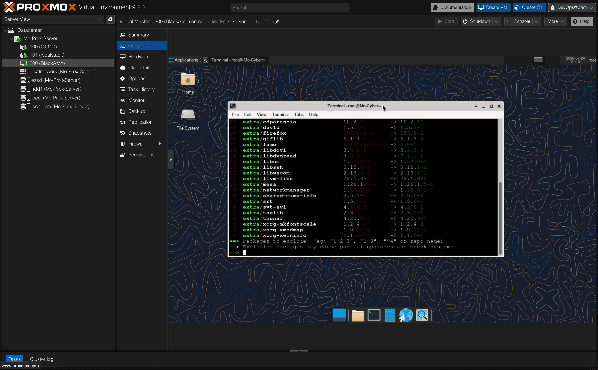
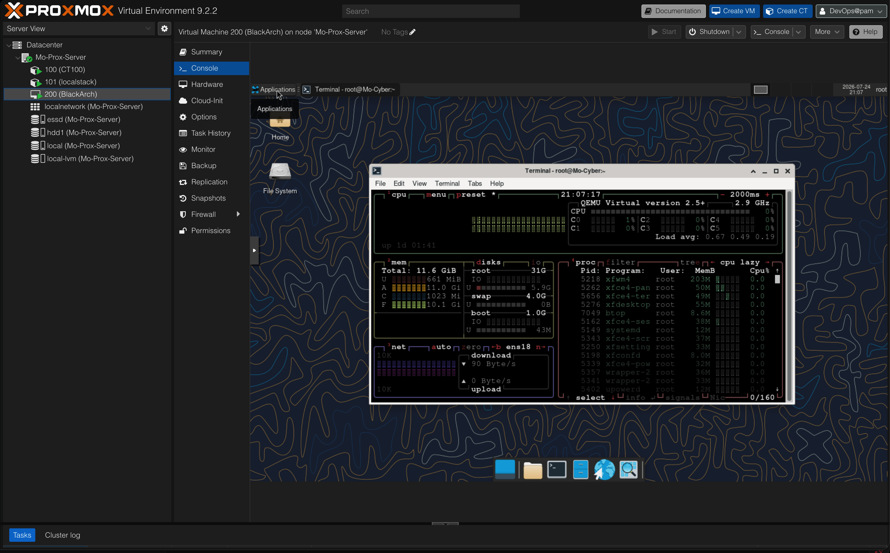

# BlackArch VM (VM 200)





## Documentation for the BlackArch virtual machine running on Proxmox node `Mo-Prox-Server`.

## System Overview

* **VM ID:** 200
* **Host:** Mo-Prox-Server
* **OS:** Arch Linux (x86_64) + BlackArch repo
* **DE:** XFCE4

## Specs

* **CPU:** 6 Cores
* **RAM:** 12 GB
* **Disk:** 80 GB
* **Interface:** `ens18`

## User Setup Commands (Run as root)

Commands used to create the non-root user:

```sh
# Create user and add to wheel group
useradd -m -G wheel,storage,power,network -s /usr/bin/bash homelab
passwd homelab
```

```sh
# Give wheel group sudo access
echo "%wheel ALL=(ALL:ALL) ALL" > /etc/sudoers.d/10-wheel
```
```sh
# Lock root password
passwd -l root

```


## Useful Commands 

```sh 
# To update everything ! 
sudo pacman -Syu
``` 


```sh 
# Search BlackArch packages
pacman -Ss <tool_name>
``` 

# btop 




```sh
# to install btop 
sudo yay -S btop 
btop
``` 


```sh
# to reboot the vm 
sudo reboot
``` 

```sh 
# to Shut it down 
sudo shutdown now 
```