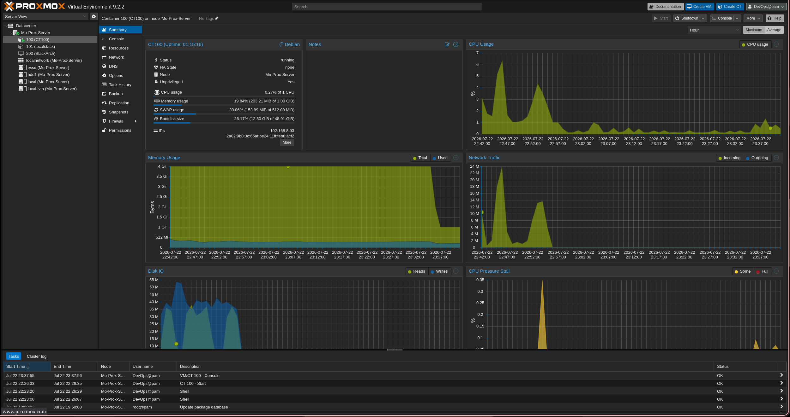

# Nextcloud

My self-hosted cloud storage. Runs as a TurnKey LXC on Proxmox — basically my own private Google Drive. All my files and photos stay on my hardware, nothing goes to a third party.

## Why

I wanted a way to sync files across my devices and auto-backup photos from my phone without relying on iCloud or Google. Nextcloud handles all of that, and since it's behind Tailscale, I can access it from anywhere without exposing anything to the internet.

## How It Runs

I'm using the TurnKey Linux Nextcloud appliance as an LXC container. TurnKey is a library of pre-built Linux appliances — basically ready-to-go server images for common self-hosted apps. The Nextcloud one comes with Apache (web server), MariaDB (database), and PHP already configured, so there's not much to set up on the application side.

LXC (Linux Containers) is a lightweight virtualization method built into Proxmox. Unlike a full VM, an LXC container shares the host kernel, so it uses way less resources — perfect for something like Nextcloud that doesn't need its own OS.

| Resource | Value |
|----------|-------|
| Type | LXC (Unprivileged) |
| Cores | 1 |
| RAM | 1 GB |
| Storage | HDD (`/mnt/hdd1`) |





## Setup

### 1. Download the TurnKey Template

First, log into the Proxmox web UI at `https://<proxmox-ip>:8006` with the root account (Linux PAM realm). Linux PAM is the default authentication realm in Proxmox — it uses the actual Linux system users on the host.

Then open a shell — either SSH into the host or use the **Shell** tab in the UI — and pull the template using `pveam`. `pveam` stands for **Proxmox VE Appliance Manager**, it's the CLI tool Proxmox uses to manage container templates (download, list, remove them).

```bash
# pull the latest list of available templates from Proxmox's online repo
pveam update

# filter the turnkeylinux section and search for nextcloud
# --section narrows it down to just TurnKey templates instead of listing everything
pveam available --section turnkeylinux | grep nextcloud

# download the template to "local" storage (the default storage in Proxmox)
# the filename comes from the output of the previous command
pveam download local debian-12-turnkey-nextcloud_18.1-1_amd64.tar.gz
```

The filename might be different depending on what version is available, so always check the output of the `pveam available` command first and use whatever it gives you.

To make sure it actually downloaded:

```bash
# lists all templates stored on local storage
pveam list local
```

### 2. Create the Container

From the Proxmox UI, hit **Create CT** (CT = Container). Picked the TurnKey template I just downloaded, set the hostname to `nextcloud`, gave it 1 core and 1GB RAM, and set a static IP on my LAN. Then just start it.

### 3. First Boot

TurnKey walks you through a setup wizard on first boot:

- Set the root password (this is the container's root, not the Proxmox host)
- Set the Nextcloud admin password (this is what you use to log into the Nextcloud web UI)
- Email config (I skipped this — it's for sending notifications, not required)
- Security updates (just let it run, it patches the container packages)

After that, Nextcloud is live at `https://<container-ip>`.

### 4. Mount the Data Drive

I didn't want Nextcloud storing data on the small container disk, so I mounted the 500GB HDD from the Proxmox host into the container. This way Nextcloud writes to the big drive instead.

On the Proxmox host:

```bash
# pct = Proxmox Container Toolkit — the CLI tool for managing LXC containers
# "set" modifies the container config
# <CTID> is the container ID number (you can find it in the Proxmox UI next to the container name)
# -mp0 = mount point 0 (first mount point)
# /mnt/hdd1/nextcloud = the path on the Proxmox HOST (source)
# mp=/mnt/data = where it appears INSIDE the container (destination)
pct set <CTID> -mp0 /mnt/hdd1/nextcloud,mp=/mnt/data
```

Then inside the container, I set the right permissions so Nextcloud can actually write to it:

```bash
# chown = change ownership of files/directories
# -R = recursive, applies to everything inside /mnt/data
# www-data:www-data = the user and group that Apache/Nextcloud runs as
# without this, Nextcloud gets "permission denied" when trying to save files
chown -R www-data:www-data /mnt/data
```

After that I went into **Settings → Administration → External Storage** in the Nextcloud web UI and added `/mnt/data` as a local mount. This tells Nextcloud to use that directory for storing user files.

### 5. Tailscale

I installed Tailscale inside the container so I can reach Nextcloud from outside my home network without opening any ports on my router. Tailscale creates a mesh VPN — every device gets a private IP (100.x.x.x) and they can talk to each other directly, no matter where they are.

```bash
# downloads and runs the Tailscale install script
# -f = fail silently on HTTP errors
# -s = silent mode (no progress bar)
# -S = show errors if they happen
# -L = follow redirects
curl -fsSL https://tailscale.com/install.sh | sh

# starts Tailscale and opens a browser link to authenticate with your Tailscale account
tailscale up

# prints the Tailscale IP assigned to this container (the 100.x.x.x address)
# -4 = show only the IPv4 address
tailscale ip -4
```

One thing you have to do is add the Tailscale IP to the trusted domains, otherwise Nextcloud will block the connection. Nextcloud only accepts connections from IPs listed in its `trusted_domains` config — this is a security feature to prevent host header attacks.

```bash
nano /var/www/nextcloud/config/config.php
```

```php
'trusted_domains' =>
array (
  0 => '<lan-ip>',        // local network IP (e.g. 192.168.1.50)
  1 => '<tailscale-ip>',  // tailscale IP (e.g. 100.x.x.x)
),
```

### 6. Phone Sync

Installed the Nextcloud app on my phone, connected using the Tailscale IP, and turned on Auto Upload for my camera roll. Now every photo I take gets backed up to the server automatically — no iCloud needed.

## Useful Commands

```bash
# check if nextcloud is running and what version it's on
# occ = "ownCloud Console" (Nextcloud forked from ownCloud, the tool name stuck)
# sudo -u www-data = run the command as the www-data user (the web server user)
sudo -u www-data php /var/www/nextcloud/occ status

# update nextcloud to the latest version
sudo -u www-data php /var/www/nextcloud/occ upgrade

# if I manually drop files into the data directory (via terminal or Samba),
# Nextcloud won't see them until I run a file scan
# --all = scan for all users
sudo -u www-data php /var/www/nextcloud/occ files:scan --all
```

## Links

- [Nextcloud Admin Manual](https://docs.nextcloud.com/server/latest/admin_manual/)
- [TurnKey Nextcloud](https://www.turnkeylinux.org/nextcloud)
- [Tailscale Docs](https://tailscale.com/kb/)
